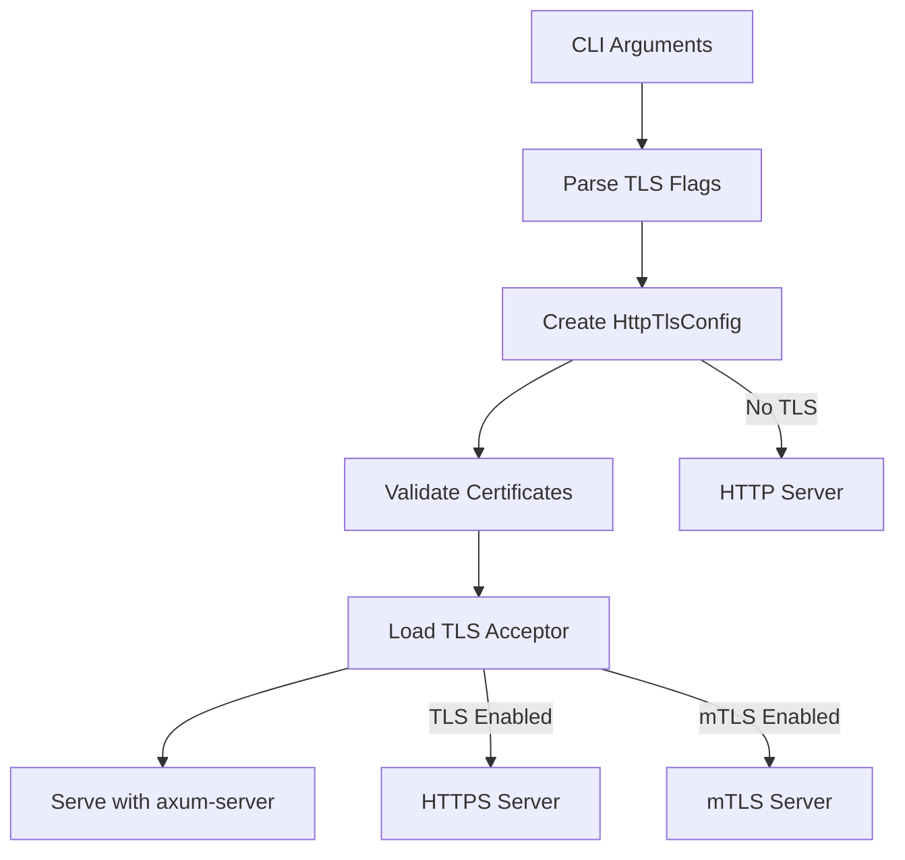
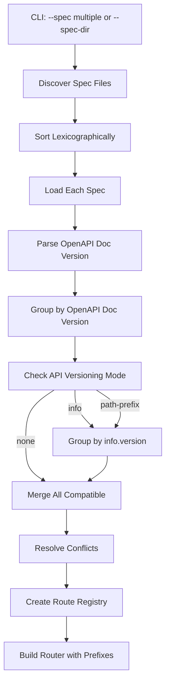

# HTTPS/TLS and Multiple OpenAPI Specs Support

## Overview

This plan implements two features:
1. **HTTPS/TLS Support**: Add CLI flags for TLS configuration and implement native TLS serving using axum-server
2. **Multiple OpenAPI Specs**: Support loading multiple spec files or a directory, with version-based grouping and conflict resolution

## Architecture

### HTTPS/TLS Implementation



### Multiple Specs Loading



## Implementation Details

### 1. HTTPS/TLS Support

#### 1.1 Add CLI Flags
**File**: `crates/mockforge-cli/src/main.rs`

Add new arguments to the `serve` command:
- `--tls-enabled`: Enable TLS/HTTPS (flag)
- `--tls-cert <path>`: Path to certificate file (PEM format)
- `--tls-key <path>`: Path to private key file (PEM format)
- `--tls-ca <path>`: Optional CA certificate for mTLS
- `--tls-min-version <version>`: Minimum TLS version (1.2 or 1.3, default: 1.2)
- `--mtls <mode>`: Mutual TLS mode: `off` (default), `optional`, `required`

**Location**: Around line 2800-2900 where other serve arguments are defined

**Validation**:
- If `--tls-enabled`, require `--tls-cert` and `--tls-key`
- If `--mtls` is `optional` or `required`, require `--tls-ca`
- If `--mtls` is set but `--tls-enabled` is false, error

#### 1.2 Add axum-server Dependency
**File**: `crates/mockforge-http/Cargo.toml`

Add dependency:
```toml
axum-server = "0.6"
```

Note: `tokio-rustls` is already present (line 71), which is compatible with axum-server.

#### 1.3 Implement Native TLS Serving
**File**: `crates/mockforge-http/src/lib.rs`

Replace the current `serve_with_tls()` function (lines 1328-1348) that only validates certificates. Implement actual TLS serving:

1. Use `axum_server::bind_rustls()` with the TLS acceptor
2. Handle mTLS modes:
   - `off`: No client certificate required
   - `optional`: Accept client certs if provided, but don't require
   - `required`: Require valid client certificate
3. Remove the error message suggesting reverse proxy - actually serve HTTPS

**Key changes**:
```rust
async fn serve_with_tls(
    addr: std::net::SocketAddr,
    app: Router,
    tls_config: &mockforge_core::config::HttpTlsConfig,
) -> Result<(), Box<dyn std::error::Error + Send + Sync>> {
    let acceptor = tls::load_tls_acceptor(tls_config)?;
    
    // Use axum-server for native TLS support
    axum_server::bind_rustls(addr, acceptor)
        .serve(app.into_make_service())
        .await?;
    
    Ok(())
}
```

#### 1.4 Update TLS Config Structure
**File**: `crates/mockforge-core/src/config.rs`

Update `HttpTlsConfig` (around line 1012) to include:
- `mtls_mode: String` field (with enum: `off`, `optional`, `required`)

#### 1.5 Update Config Loading
**File**: `crates/mockforge-cli/src/main.rs` (around line 4382-4395)

Modify TLS config loading to:
1. Check CLI flags first (highest priority)
2. Fall back to config file if flags not provided
3. Merge CLI flags with config file values (CLI takes precedence)
4. If `--tls-enabled` is set, actually serve HTTPS (no fallback to HTTP)

### 2. Multiple OpenAPI Specs Support

#### 2.1 Add CLI Flags
**File**: `crates/mockforge-cli/src/main.rs`

Modify the `--spec` argument to support multiple values using `ArgAction::Append`:
- `--spec <path>`: Can be repeated multiple times (e.g., `--spec api1.yaml --spec api2.yaml`)
- `--spec-dir <directory>`: Load all OpenAPI specs from directory (discovers `.json`, `.yaml`, `.yml` files)

**New flags**:
- `--merge-conflicts <strategy>`: Conflict resolution strategy: `error` (default), `first`, `last`
- `--api-versioning <mode>`: API versioning mode: `none` (default), `info`, `path-prefix`

**Behavior**:
- If `--spec` is provided (single or multiple), use those files
- If `--spec-dir` is provided, discover all spec files in directory
- Only one of `--spec` or `--spec-dir` should be used (mutually exclusive)
- Files discovered from `--spec-dir` must be sorted lexicographically before processing

#### 2.2 Create Spec Loader Utility
**File**: `crates/mockforge-core/src/openapi/multi_spec.rs` (new file)

Create functions:

1. **`load_specs_from_directory(dir: &Path) -> Result<Vec<(PathBuf, OpenApiSpec)>>`**
   - Discover all `.json`, `.yaml`, `.yml` files recursively
   - Sort paths lexicographically for deterministic ordering
   - Load each spec, return tuples of (path, spec) for error reporting

2. **`load_specs_from_files(files: Vec<PathBuf>) -> Result<Vec<(PathBuf, OpenApiSpec)>>`**
   - Load each file
   - Return tuples for error reporting

3. **`group_specs_by_openapi_version(specs: Vec<(PathBuf, OpenApiSpec)>) -> HashMap<String, Vec<(PathBuf, OpenApiSpec)>>`**
   - Extract OpenAPI document version (`openapi` field, e.g., "3.0.0", "3.1.0")
   - Group specs by this version
   - Return map: version -> list of (path, spec) tuples

4. **`group_specs_by_api_version(specs: Vec<(PathBuf, OpenApiSpec)>) -> HashMap<String, Vec<(PathBuf, OpenApiSpec)>>`**
   - Extract API version from `info.version` field
   - Group specs by this version
   - Handle missing `info.version` by using a default group name

5. **`merge_specs(specs: Vec<(PathBuf, OpenApiSpec)>, conflict_strategy: ConflictStrategy) -> Result<OpenApiSpec, MergeConflictError>`**
   - Merge paths from all specs
   - Merge components (schemas, parameters, responses, etc.)
   - Handle conflicts based on strategy:
     - `error`: Return detailed error with conflicting paths
     - `first`: Use first spec's definition, log warning
     - `last`: Use last spec's definition, log warning
   - For component conflicts, check if definitions are byte-for-byte identical (allow silently if so)

6. **`detect_conflicts(specs: &[(PathBuf, OpenApiSpec)]) -> Vec<Conflict>`**
   - Detect route conflicts (same METHOD + PATH)
   - Detect component key conflicts (same key, different definitions)
   - Return list of conflicts with file paths

**Conflict Strategy Enum**:
```rust
pub enum ConflictStrategy {
    Error,  // Fail fast on conflicts
    First,  // First file wins
    Last,   // Last file wins
}
```

#### 2.3 Update Route Registry
**File**: `crates/mockforge-core/src/openapi_routes.rs`

Modify `OpenApiRouteRegistry` to support:
- Multiple registries (one per API version group when using `path-prefix`)
- Unified route building that combines all registries
- Path prefixing for different API versions

**New approach**:
- When `--api-versioning=none`: Merge all specs into single registry, build single router
- When `--api-versioning=info` or `path-prefix`: 
  - Create separate registries per API version group
  - Build separate routers per group
  - Apply path prefixes (e.g., `/v1`, `/v2`) when `path-prefix` mode
  - Merge routers with prefix middleware

#### 2.4 Update HTTP Server Integration
**File**: `crates/mockforge-http/src/lib.rs`

Update functions to accept multiple specs:
- `build_router_from_spec()` → `build_router_from_specs()`
- Accept `Vec<PathBuf>` instead of `Option<PathBuf>`
- Accept conflict strategy and API versioning mode

**Processing flow**:
1. Load all specs (from files or directory)
2. Group by OpenAPI doc version (for parser compatibility)
3. Within each OpenAPI version group:
   - Apply API versioning grouping if enabled
   - Merge specs according to conflict strategy
   - Create registries per API version group
4. Build routers with appropriate path prefixes
5. Merge all routers into final router

**Location**: Functions around lines 658-700, 1232-1248, 1512-1541

#### 2.5 Error Handling
**File**: `crates/mockforge-core/src/openapi/multi_spec.rs`

Create detailed error types:
```rust
pub enum MergeConflictError {
    RouteConflict {
        method: String,
        path: String,
        files: Vec<PathBuf>,
    },
    ComponentConflict {
        component_type: String, // "schemas", "parameters", etc.
        key: String,
        files: Vec<PathBuf>,
    },
}
```

Error messages should be clear:
- `Conflict: GET /users defined in specA.yaml and specB.yaml`
- `Conflict: components.schemas.User defined differently in specA.yaml and specB.yaml`

## Files to Modify

1. **`crates/mockforge-cli/src/main.rs`**
   - Modify `--spec` to use `ArgAction::Append` (lines ~2800-2900)
   - Add `--spec-dir` flag
   - Add `--merge-conflicts` flag
   - Add `--api-versioning` flag
   - Add TLS CLI flags (lines ~2800-2900)
   - Update `handle_serve()` to process new flags (lines ~3388-3444)
   - Update TLS config loading (lines ~4382-4395)

2. **`crates/mockforge-http/src/lib.rs`**
   - Implement native TLS serving in `serve_with_tls()` using axum-server (lines ~1328-1348)
   - Update router building functions to accept multiple specs (lines ~658-700, ~1232-1248, ~1512-1541)
   - Add path prefix middleware for API versioning

3. **`crates/mockforge-http/src/tls.rs`**
   - Update `load_tls_acceptor()` to handle mTLS modes
   - Configure client certificate verification based on mTLS mode

4. **`crates/mockforge-core/src/openapi/multi_spec.rs`** (new file)
   - Implement all multi-spec loading and merging utilities
   - Implement conflict detection and resolution

5. **`crates/mockforge-core/src/openapi_routes.rs`**
   - Update `OpenApiRouteRegistry` to support multiple specs
   - Add support for path-prefixed registries

6. **`crates/mockforge-core/src/config.rs`**
   - Update `HttpTlsConfig` to include `mtls_mode` field

7. **`crates/mockforge-http/Cargo.toml`**
   - Add `axum-server = "0.6"` dependency

## Testing Considerations

1. **TLS Tests**:
   - Test with self-signed certificates
   - Test with valid certificates
   - Test mTLS modes: `off`, `optional`, `required`
   - Test fallback to HTTP when TLS disabled
   - Test CLI flags override config file

2. **Multi-Spec Tests**:
   - Test loading from directory (deterministic ordering)
   - Test loading multiple files via `--spec` (repeated)
   - Test merging specs with same OpenAPI version
   - Test conflict detection (route and component conflicts)
   - Test conflict resolution strategies (`error`, `first`, `last`)
   - Test API versioning modes (`none`, `info`, `path-prefix`)
   - Test path prefix mounting
   - Test backward compatibility with single `--spec`
   - Test identical component definitions (should merge silently)

3. **Integration Tests**:
   - Test HTTPS server actually serves HTTPS (not just validates)
   - Test multiple specs merged correctly
   - Test path prefixes work correctly
   - Test conflict errors are clear and actionable

## Design Decisions

### Conflict Resolution
- **Default**: Fail fast with clear error messages showing conflicting files
- **Override**: `--merge-conflicts {error|first|last}` for advanced use cases
- **Component conflicts**: Check for byte-for-byte identical definitions before erroring

### Version Separation
- **OpenAPI doc version** (`openapi` field): Used for parser/validator compatibility grouping
- **API version** (`info.version`): Used for logical API versioning when `--api-versioning` is enabled
- **Path prefixes**: Applied when `--api-versioning=path-prefix` to mount different API versions

### TLS Implementation
- **Library**: axum-server (axum-native, straightforward)
- **mTLS**: Explicit `--mtls` flag with three modes (`off`, `optional`, `required`)
- **No fallback**: If `--tls-enabled`, must serve HTTPS or error (no silent HTTP fallback)

### CLI Ergonomics
- **Single flag repetition**: `--spec` can be repeated instead of separate `--specs` flag
- **Deterministic ordering**: Files from directory sorted lexicographically
- **Mutually exclusive**: `--spec` and `--spec-dir` cannot be used together
