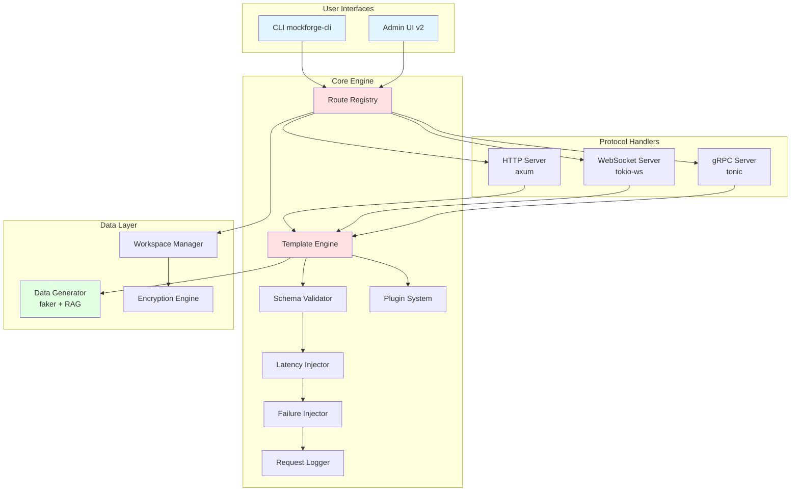
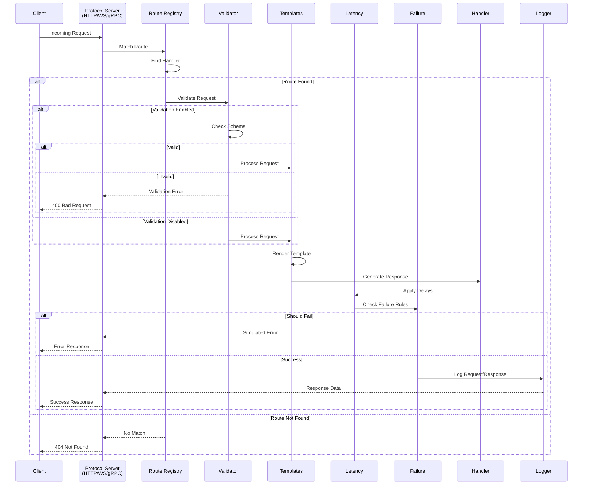
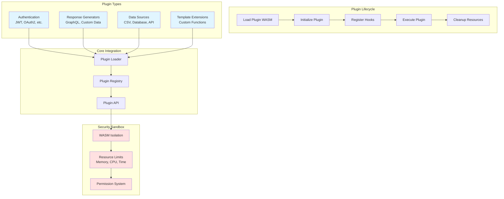

# Architecture Overview

MockForge is a modular, Rust-based platform for mocking APIs across HTTP, WebSocket, and gRPC protocols. This document provides a comprehensive overview of the system architecture, design principles, and component interactions.

## System Overview

MockForge enables frontend and integration development without live backends by providing realistic API mocking with configurable latency, failure injection, and dynamic response generation. The system is built as a modular workspace of Rust crates that share a core engine for request routing, validation, and data generation.

### Key Design Principles

- **Modularity**: Separated concerns across focused crates
- **Extensibility**: Plugin architecture for custom functionality
- **Performance**: Async-first design with efficient resource usage
- **Developer Experience**: Comprehensive tooling and clear APIs
- **Protocol Agnostic**: Unified approach across different protocols

## High-Level Architecture



## Crate Structure

MockForge is organized as a Cargo workspace with the following crates:

```
mockforge/
  crates/
    mockforge-cli/     # Command-line interface
    mockforge-core/    # Shared functionality
    mockforge-http/    # HTTP REST API mocking
    mockforge-ws/      # WebSocket connection mocking
    mockforge-grpc/    # gRPC service mocking
    mockforge-data/   # Synthetic data generation
    mockforge-ui/      # Web-based admin interface
```

### Crate Responsibilities

#### `mockforge-core` - Shared Core Engine

The foundation crate providing common functionality used across all protocols:

- **Request Routing**: Unified route registry and matching logic
- **Validation Engine**: OpenAPI and schema validation
- **Template System**: Handlebars-based dynamic content generation
- **Latency Injection**: Configurable response delays
- **Failure Injection**: Simulated error conditions
- **Record/Replay**: Request/response capture and replay
- **Logging**: Structured request/response logging
- **Configuration**: Unified configuration management

#### `mockforge-http` - HTTP REST API Mocking

HTTP-specific implementation built on axum:

- **OpenAPI Integration**: Automatic route generation from specifications
- **Request Matching**: Method, path, query, header, and body matching
- **Response Generation**: Schema-driven and template-based responses
- **Middleware Support**: Custom request/response processing

#### `mockforge-ws` - WebSocket Connection Mocking

Real-time communication mocking:

- **Replay Mode**: Scripted message sequences with timing control
- **Interactive Mode**: Dynamic responses based on client messages
- **State Management**: Connection-specific state tracking
- **Template Support**: Dynamic message content generation

#### `mockforge-grpc` - gRPC Service Mocking

Protocol buffer-based service mocking:

- **Dynamic Proto Discovery**: Automatic compilation of `.proto` files
- **Service Reflection**: Runtime service discovery and inspection
- **Streaming Support**: Unary, server, client, and bidirectional streaming
- **Schema Validation**: Message validation against proto definitions

#### `mockforge-data` - Synthetic Data Generation

Advanced data generation capabilities:

- **Faker Integration**: Realistic fake data generation
- **RAG Enhancement**: Retrieval-augmented generation for contextual data
- **Schema-Driven Generation**: Data conforming to JSON Schema/OpenAPI specs
- **Template Helpers**: Integration with core templating system

#### `mockforge-cli` - Command-Line Interface

User-facing command-line tool:

- **Server Management**: Start/stop mock servers
- **Configuration**: Load and validate configuration files
- **Data Generation**: Command-line data generation utilities
- **Development Tools**: Testing and debugging utilities

#### `mockforge-ui` - Admin Web Interface

Browser-based management interface:

- **Real-time Monitoring**: Live request/response viewing
- **Configuration Management**: Runtime configuration changes
- **Fixture Management**: Recorded interaction management
- **Performance Metrics**: Response times and error rates

## Core Engine Architecture

### Request Processing Pipeline

All requests follow a unified processing pipeline regardless of protocol:

1. **Request Reception**: Protocol-specific server receives request
2. **Route Matching**: Core routing engine matches request to handler
3. **Validation**: Schema validation if enabled
4. **Template Processing**: Dynamic content generation
5. **Latency Injection**: Artificial delays if configured
6. **Failure Injection**: Error simulation if enabled
7. **Response Generation**: Handler generates response
8. **Logging**: Request/response logging
9. **Response Delivery**: Protocol-specific response sending



### Route Registry System

The core routing system provides unified route management:

```rust
pub struct RouteRegistry {
    routes: HashMap<RouteKey, Vec<RouteHandler>>,
    overrides: Overrides,
    validation_mode: ValidationMode,
}

impl RouteRegistry {
    pub fn register(&mut self, key: RouteKey, handler: RouteHandler);
    pub fn match_route(&self, request: &Request) -> Option<&RouteHandler>;
    pub fn apply_overrides(&mut self, overrides: &Overrides);
}
```

### Template Engine

Handlebars-based templating with custom helpers:

```rust
pub struct TemplateEngine {
    registry: handlebars::Handlebars<'static>,
}

impl TemplateEngine {
    pub fn render(&self, template: &str, context: &Context) -> Result<String>;
    pub fn register_helper(&mut self, name: &str, helper: Box<dyn HelperDef>);
}
```

Built-in helpers include:
- `uuid`: Generate unique identifiers
- `now`: Current timestamp
- `randInt`: Random integers
- `request`: Access request data
- `faker`: Synthetic data generation

### Plugin System Architecture

MockForge uses a WebAssembly-based plugin system for extensibility:



**Plugin Hook Points:**

1. **Request Interceptors**: Modify incoming requests
2. **Response Generators**: Create custom response data
3. **Template Helpers**: Add custom template functions
4. **Authentication Providers**: Implement auth schemes
5. **Data Source Connectors**: Connect to external data sources

**Security Model:**

- WASM sandboxing isolates plugin execution
- Resource limits prevent DoS attacks
- Permission system controls plugin capabilities
- Plugin signature verification (planned)

This architecture provides a solid foundation for API mocking while maintaining extensibility, performance, and developer experience. The modular design allows for independent evolution of each protocol implementation while sharing common infrastructure.
