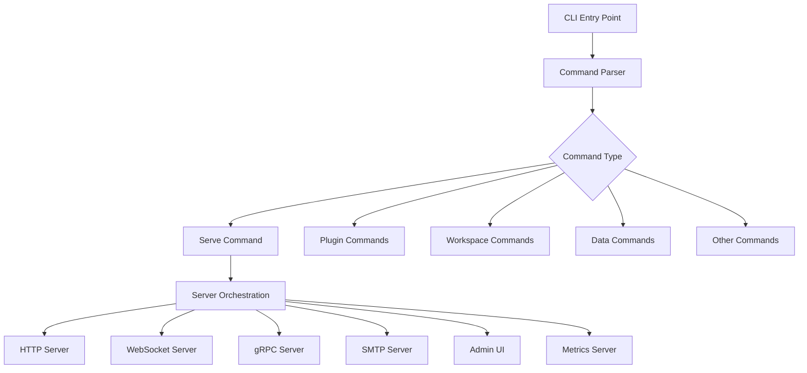

# CLI Crate

The `mockforge-cli` crate provides the primary command-line interface for MockForge, serving as the main entry point for users to interact with the MockForge ecosystem. It orchestrates all MockForge services and provides comprehensive configuration and management capabilities.

## Architecture Overview



## Core Components

### Command Structure

The CLI uses [clap](https://github.com/clap-rs/clap) for argument parsing and command structure. The main `Cli` struct defines the top-level interface with global options and subcommands.

#### Main Commands

- **`serve`**: Start MockForge servers (HTTP, WebSocket, gRPC, SMTP)
- **`admin`**: Start standalone admin UI server
- **`sync`**: Bidirectional workspace synchronization daemon
- **`plugin`**: Plugin management (install, uninstall, update, list)
- **`workspace`**: Multi-tenant workspace management
- **`data`**: Synthetic data generation
- **`generate-tests`**: Test generation from recorded API interactions
- **`suggest`**: AI-powered API specification suggestions
- **`bench`**: Load testing against real services
- **`orchestrate`**: Chaos experiment orchestration

### Server Orchestration

The `serve` command is the most complex, supporting extensive configuration options:

#### Server Types
- **HTTP Server**: REST API mocking with OpenAPI support
- **WebSocket Server**: Real-time messaging simulation
- **gRPC Server**: Protocol buffer-based service mocking
- **SMTP Server**: Email service simulation
- **Admin UI**: Web-based management interface
- **Metrics Server**: Prometheus metrics endpoint

#### Configuration Layers

The CLI implements a three-tier configuration precedence system:

1. **CLI Arguments**: Highest precedence, command-line flags
2. **Configuration File**: YAML/JSON config file (optional)
3. **Environment Variables**: Lowest precedence, environment overrides

#### Advanced Features

- **Chaos Engineering**: Fault injection, latency simulation, network degradation
- **Traffic Shaping**: Bandwidth limiting, packet loss simulation
- **Observability**: OpenTelemetry tracing, Prometheus metrics, API flight recording
- **AI Integration**: RAG-powered intelligent mocking
- **Multi-tenancy**: Workspace isolation and management

## Key Modules

### `main.rs`
The main entry point that:
- Parses CLI arguments using clap
- Initializes logging and observability
- Routes commands to appropriate handlers
- Manages server lifecycle and graceful shutdown

### `plugin_commands.rs`
Handles plugin ecosystem management:
- Plugin installation from various sources (URLs, Git repos, local paths)
- Plugin validation and security verification
- Cache management for downloaded plugins
- Registry integration (future feature)

### `workspace_commands.rs`
Multi-tenant workspace management:
- CRUD operations for workspaces
- Workspace statistics and monitoring
- Enable/disable workspace functionality
- REST API integration with admin UI

### Import Modules
- `curl_import.rs`: Convert curl commands to MockForge configurations
- `postman_import.rs`: Import Postman collections
- `insomnia_import.rs`: Import Insomnia workspaces
- `import_utils.rs`: Shared utilities for import operations

## Configuration Management

### Server Configuration Building

The `build_server_config_from_cli()` function merges configuration from multiple sources:

```rust
// Step 1: Load config from file if provided
let mut config = load_config_with_fallback(path)?;

// Step 2: Apply environment variable overrides
config = apply_env_overrides(config);

// Step 3: Apply CLI argument overrides (highest precedence)
config.http.port = serve_args.http_port;
// ... more overrides
```

### Validation

Before starting servers, the CLI performs comprehensive validation:
- Configuration file existence and readability
- OpenAPI spec file validation
- Port availability checking
- Dry-run mode for configuration testing

## Server Lifecycle Management

### Concurrent Server Startup

All servers are started concurrently using Tokio tasks:

```rust
// Start HTTP server
let http_handle = tokio::spawn(async move {
    mockforge_http::serve_router(http_port, http_app)
});

// Start WebSocket server
let ws_handle = tokio::spawn(async move {
    mockforge_ws::start_with_latency(ws_port, None)
});

// Start gRPC server
let grpc_handle = tokio::spawn(async move {
    mockforge_grpc::start(grpc_port)
});
```

### Graceful Shutdown

The CLI implements graceful shutdown using Tokio's `CancellationToken`:

```rust
let shutdown_token = CancellationToken::new();

// All servers listen for cancellation
tokio::select! {
    result = server_task => { /* handle result */ }
    _ = shutdown_token.cancelled() => { /* cleanup */ }
}
```

## Integration Points

### Core Crate Dependencies

The CLI depends on all MockForge service crates:
- `mockforge-core`: Configuration and shared utilities
- `mockforge-http`: HTTP server implementation
- `mockforge-ws`: WebSocket server
- `mockforge-grpc`: gRPC server
- `mockforge-smtp`: SMTP server
- `mockforge-ui`: Admin interface
- `mockforge-observability`: Metrics and tracing
- `mockforge-data`: Data generation and RAG
- `mockforge-plugin-*`: Plugin ecosystem

### External Integrations

- **OpenTelemetry**: Distributed tracing
- **Prometheus**: Metrics collection
- **Jaeger**: Trace visualization
- **Plugin Registry**: Remote plugin distribution
- **AI Providers**: OpenAI, Anthropic, Ollama for intelligent features

## Error Handling

The CLI implements comprehensive error handling:
- User-friendly error messages with suggestions
- Validation errors with specific guidance
- Network error recovery and retry logic
- Graceful degradation when services fail

## Testing

The CLI includes integration tests in `tests/cli_integration_tests.rs` and configuration validation tests in `tests/config_validation_tests.rs`, ensuring reliability of the command-line interface and configuration parsing.

## Future Enhancements

- **Plugin Marketplace**: Integrated plugin discovery and installation
- **Interactive Mode**: Shell-like interface for complex workflows
- **Configuration Wizards**: Guided setup for new users
- **Remote Management**: Cloud-based MockForge instance management