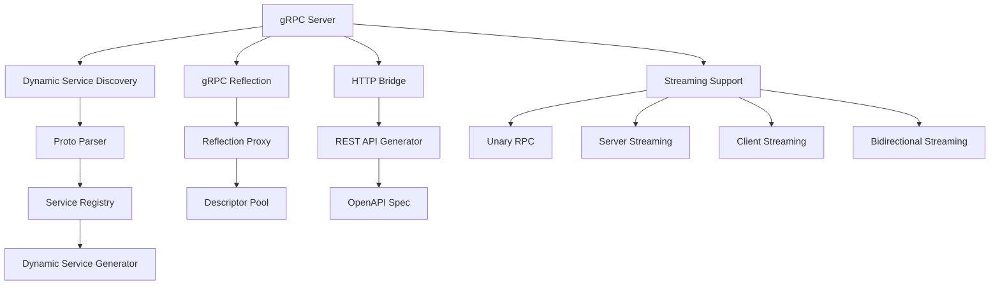

# gRPC Crate

The `mockforge-grpc` crate provides comprehensive gRPC protocol support for MockForge, featuring dynamic service discovery, runtime protobuf parsing, and HTTP bridge capabilities. It enables automatic mocking of gRPC services without code generation, supporting all streaming patterns and providing rich introspection features.

## Architecture Overview



## Core Components

### Dynamic Service Discovery

The gRPC crate's core innovation is runtime service discovery and mocking without code generation:

#### Proto Parser
```rust
// Parse protobuf files at runtime
let mut parser = ProtoParser::new();
parser.parse_directory("./proto").await?;

// Extract services and methods
let services = parser.services();
let descriptor_pool = parser.into_pool();
```

#### Service Registry
```rust
// Create registry with parsed services
let mut registry = ServiceRegistry::with_descriptor_pool(descriptor_pool);

// Register dynamic service implementations
for (name, proto_service) in services {
    let dynamic_service = DynamicGrpcService::new(proto_service, config);
    registry.register(name, dynamic_service);
}
```

### gRPC Reflection

#### Reflection Proxy
Enables runtime service discovery and method invocation:

```rust
let proxy_config = ProxyConfig::default();
let mock_proxy = MockReflectionProxy::new(proxy_config, registry).await?;

// Server supports reflection queries
// grpcurl -plaintext localhost:50051 list
// grpcurl -plaintext localhost:50051 describe MyService
```

#### Descriptor Management
- **Descriptor Pool**: In-memory protobuf descriptor storage
- **Dynamic Resolution**: Runtime method and message resolution
- **Schema Introspection**: Full protobuf schema access

### HTTP Bridge

#### REST API Generation
Automatically converts gRPC services to REST endpoints:

```rust
let config = DynamicGrpcConfig {
    enable_http_bridge: true,
    http_bridge_port: 8080,
    generate_openapi: true,
    ..Default::default()
};

// gRPC: MyService/GetUser → HTTP: POST /api/myservice/getuser
```

#### OpenAPI Generation
- Automatic OpenAPI 3.0 spec generation from protobuf definitions
- REST endpoint documentation
- Request/response schema documentation

### Streaming Support

#### All Streaming Patterns
The crate supports all four gRPC streaming patterns:

- **Unary RPC**: Simple request-response
- **Server Streaming**: Single request, streaming response
- **Client Streaming**: Streaming request, single response
- **Bidirectional Streaming**: Streaming in both directions

#### Streaming Implementation
```rust
// Server streaming
async fn list_users(
    &self,
    request: Request<ListUsersRequest>,
) -> Result<Response<Self::ListUsersStream>, Status> {
    // Return stream of User messages
}

// Bidirectional streaming
async fn chat(
    &self,
    request: Request<Streaming<ChatMessage>>,
) -> Result<Response<Self::ChatStream>, Status> {
    // Handle bidirectional message stream
}
```

## Key Modules

### `dynamic/`
Core dynamic service functionality:

#### `proto_parser.rs`
- Runtime protobuf file parsing
- Service and method extraction
- Message descriptor generation

#### `service_generator.rs`
- Dynamic service implementation generation
- Mock response synthesis
- Streaming method handling

#### `http_bridge/`
- REST API conversion logic
- OpenAPI specification generation
- HTTP request/response mapping

### `reflection/`
gRPC reflection protocol implementation:

#### `mock_proxy.rs`
- Reflection service implementation
- Dynamic method invocation
- Response generation

#### `client.rs`
- Reflection client for service discovery
- Dynamic RPC calls
- Connection pooling

#### `smart_mock_generator.rs`
- AI-powered response generation
- Schema-aware data synthesis
- Contextual mock data

### `registry.rs`
Service registration and management:

```rust
pub struct GrpcProtoRegistry {
    services: HashMap<String, ProtoService>,
    descriptor_pool: DescriptorPool,
}
```

## Configuration

### DynamicGrpcConfig
```rust
#[derive(Debug, Clone)]
pub struct DynamicGrpcConfig {
    pub proto_dir: String,                    // Proto file directory
    pub enable_reflection: bool,              // Enable gRPC reflection
    pub excluded_services: Vec<String>,       // Services to skip
    pub http_bridge: Option<HttpBridgeConfig>, // HTTP bridge settings
    pub max_message_size: usize,              // Max message size
}
```

### HTTP Bridge Config
```rust
pub struct HttpBridgeConfig {
    pub enabled: bool,                        // Enable HTTP bridge
    pub port: u16,                           // HTTP server port
    pub generate_openapi: bool,              // Generate OpenAPI specs
    pub cors_enabled: bool,                  // Enable CORS
}
```

## Advanced Data Synthesis

### Intelligent Field Inference
The crate uses field names and types to generate realistic mock data:

```protobuf
message User {
  string id = 1;           // Generates UUIDs
  string email = 2;        // Generates email addresses
  string phone = 3;        // Generates phone numbers
  repeated string tags = 4; // Generates string arrays
}
```

### Referential Integrity
Maintains relationships between messages:
- Foreign key relationships
- Consistent ID generation
- Cross-message data consistency

### Deterministic Seeding
```rust
// Reproducible test data
let config = MockConfig {
    seed: Some(42),
    ..Default::default()
};
```

## Performance Features

### Connection Pooling
- Efficient gRPC connection management
- Connection reuse and lifecycle management
- Load balancing across connections

### Caching
- Descriptor caching for performance
- Response caching for repeated requests
- Schema compilation caching

### Async Processing
- Tokio-based async runtime
- Streaming data processing
- Concurrent request handling

## Integration Points

### Core Dependencies
- `mockforge-core`: Base mocking functionality
- `mockforge-data`: Advanced data generation
- `mockforge-observability`: Metrics and tracing

### External Libraries
- **Tonic**: gRPC framework for Rust
- **Prost**: Protocol buffer implementation
- **Prost-reflect**: Runtime protobuf reflection
- **Tokio**: Async runtime

## Observability

### Metrics Collection
- Request/response counts
- Method execution times
- Error rates by service/method
- Streaming metrics

### Tracing Integration
- OpenTelemetry tracing support
- Distributed tracing across services
- Request correlation IDs

### Logging
- Structured logging for all operations
- Debug logging for request/response payloads
- Performance logging

## Testing Support

### Integration Tests
- End-to-end gRPC testing
- HTTP bridge validation
- Reflection service testing
- Streaming functionality tests

### Mock Data Generation
- Deterministic test data
- Schema-compliant mock generation
- Custom data providers

## Error Handling

### gRPC Status Codes
- Proper gRPC status code mapping
- Detailed error messages
- Error correlation IDs

### Recovery Mechanisms
- Connection retry logic
- Graceful degradation
- Fallback responses

## Build System

### Proto Compilation
The crate uses `tonic-prost-build` for compile-time proto generation:

```rust
// build.rs
fn main() -> Result<(), Box<dyn std::error::Error>> {
    tonic_build::compile_protos("proto/greeter.proto")?;
    Ok(())
}
```

### Feature Flags
- `data-faker`: Enable advanced data synthesis
- Default features include data faker for rich mock data

## Usage Examples

### Basic gRPC Server
```rust
use mockforge_grpc::start;

#[tokio::main]
async fn main() -> Result<(), Box<dyn std::error::Error + Send + Sync>> {
    // Auto-discovers services from ./proto directory
    start(50051).await?;
    Ok(())
}
```

### With HTTP Bridge
```rust
use mockforge_grpc::{start_with_config, DynamicGrpcConfig};

let config = DynamicGrpcConfig {
    proto_dir: "./proto".to_string(),
    enable_reflection: true,
    http_bridge: Some(HttpBridgeConfig {
        enabled: true,
        port: 8080,
        generate_openapi: true,
    }),
    ..Default::default()
};

start_with_config(50051, None, config).await?;
```

### Client Usage
```bash
# List services
grpcurl -plaintext localhost:50051 list

# Describe service
grpcurl -plaintext localhost:50051 describe MyService

# Call method
grpcurl -plaintext -d '{"id": "123"}' localhost:50051 MyService/GetUser

# HTTP bridge
curl -X POST http://localhost:8080/api/myservice/getuser \
  -H "Content-Type: application/json" \
  -d '{"id": "123"}'
```

## Future Enhancements

- **Advanced Streaming**: Enhanced bidirectional streaming support
- **Service Mesh Integration**: Istio and Linkerd integration
- **Schema Evolution**: Automatic handling of protobuf schema changes
- **Load Testing**: Built-in gRPC load testing capabilities
- **Code Generation**: Optional compile-time service generation