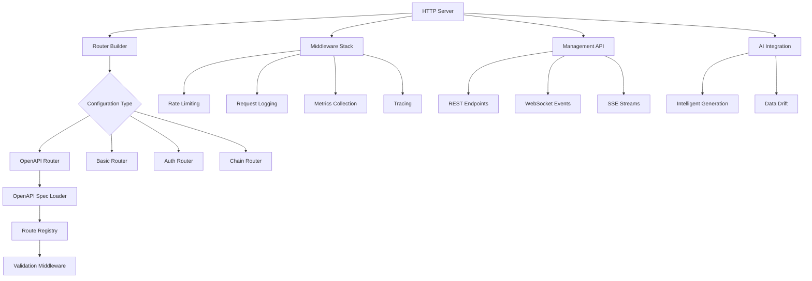

# HTTP Crate

The `mockforge-http` crate provides comprehensive HTTP/REST API mocking capabilities for MockForge, built on top of the [Axum](https://github.com/tokio-rs/axum) web framework. It integrates OpenAPI specification support, AI-powered response generation, comprehensive management APIs, and advanced middleware for observability and traffic control.

## Architecture Overview



## Core Components

### Router Building System

The HTTP crate provides multiple router builders for different use cases:

#### `build_router()`
Basic router with optional OpenAPI integration:
- Loads and validates OpenAPI specifications
- Creates route handlers from spec operations
- Applies validation middleware
- Includes health check endpoints

#### `build_router_with_auth()`
Router with authentication support:
- Integrates OAuth2 and JWT authentication
- Supports custom auth middleware
- Validates tokens and permissions

#### `build_router_with_chains()`
Router with request chaining support:
- Enables multi-step request workflows
- Manages chain execution state
- Provides chain management endpoints

#### `build_router_with_traffic_shaping()`
Router with traffic control:
- Bandwidth limiting and packet loss simulation
- Network condition emulation
- Traffic shaping middleware

### OpenAPI Integration

#### Specification Loading
```rust
// Load OpenAPI spec from file
let openapi = OpenApiSpec::from_file("api.yaml").await?;

// Create route registry with validation options
let registry = OpenApiRouteRegistry::new_with_options(
    openapi,
    ValidationOptions::enforce()
);
```

#### Route Generation
- Automatic endpoint creation from OpenAPI operations
- Parameter extraction and validation
- Response schema validation
- Error response generation

#### Validation Modes
- **Strict**: Full request/response validation
- **Lenient**: Warnings for validation failures
- **Disabled**: No validation (performance mode)

### Middleware Architecture

#### Request Processing Pipeline
```
Request → Rate Limiting → Authentication → Logging → Metrics → Handler → Response
```

#### Key Middleware Components

- **Rate Limiting**: Uses `governor` crate for distributed rate limiting
- **Request Logging**: Comprehensive HTTP request/response logging
- **Metrics Collection**: Prometheus-compatible metrics
- **Tracing**: OpenTelemetry integration for distributed tracing
- **Traffic Shaping**: Bandwidth and latency control

### Management API

#### REST Endpoints
- `GET /__mockforge/health` - Health check
- `GET /__mockforge/stats` - Server statistics
- `GET /__mockforge/routes` - Route information
- `GET /__mockforge/coverage` - API coverage metrics
- `GET/POST/PUT/DELETE /__mockforge/mocks` - Mock management

#### WebSocket Integration
- Real-time server events
- Live request monitoring
- Interactive mock configuration

#### Server-Sent Events (SSE)
- Log streaming to clients
- Real-time metrics updates
- Coverage report streaming

### AI-Powered Features

#### Intelligent Mock Generation
```rust
let ai_config = AiResponseConfig {
    enabled: true,
    rag_config: RagConfig {
        provider: "openai".to_string(),
        model: "gpt-4".to_string(),
        api_key: Some(api_key),
    },
    prompt: "Generate realistic user data".to_string(),
};

let response = process_response_with_ai(&ai_config, request_data).await?;
```

#### Data Drift Simulation
- Progressive response changes over time
- Realistic data evolution patterns
- Configurable drift parameters

### Authentication System

#### Supported Methods
- **OAuth2**: Authorization code, client credentials flows
- **JWT**: Token validation and claims extraction
- **API Keys**: Header and query parameter validation
- **Basic Auth**: Username/password authentication

#### Auth Middleware
```rust
let auth_middleware = auth_middleware(auth_state);
app = app.layer(auth_middleware);
```

### Request Chaining

#### Chain Execution Engine
- Multi-step request workflows
- Conditional execution based on responses
- Chain state management and persistence
- Execution history and debugging

#### Chain Management API
- `POST /__mockforge/chains` - Create chains
- `GET /__mockforge/chains/{id}/execute` - Execute chains
- `GET /__mockforge/chains/{id}/history` - View execution history

### Multi-Tenant Support

#### Workspace Isolation
- Path-based routing (`/workspace1/api/*`, `/workspace2/api/*`)
- Port-based isolation (different ports per tenant)
- Configuration isolation per workspace

#### Auto-Discovery
- Automatic workspace loading from config directories
- YAML-based workspace definitions
- Dynamic workspace registration

### Observability Integration

#### Metrics Collection
- Request/response counts and timings
- Error rates and status code distribution
- Route coverage and usage statistics
- Performance histograms

#### Tracing Integration
- Distributed tracing with OpenTelemetry
- Request correlation IDs
- Span tagging for operations
- Jaeger and Zipkin export support

#### Logging
- Structured JSON logging
- Request/response body logging (configurable)
- Error tracking and correlation
- Log level configuration

### Traffic Shaping and Chaos Engineering

#### Network Simulation
- Bandwidth limiting (bytes per second)
- Packet loss simulation (percentage)
- Latency injection (fixed or random)
- Connection failure simulation

#### Chaos Scenarios
- Predefined network profiles (3G, 4G, 5G, satellite)
- Custom traffic shaping rules
- Circuit breaker patterns
- Bulkhead isolation

### Testing and Validation

#### Integration Tests
- End-to-end request/response validation
- OpenAPI compliance testing
- Authentication flow testing
- Performance benchmarking

#### Coverage Analysis
- API endpoint coverage tracking
- Request pattern analysis
- Missing endpoint detection
- Coverage reporting and visualization

## Key Data Structures

### `HttpServerState`
Shared state for route information and rate limiting:
```rust
pub struct HttpServerState {
    pub routes: Vec<RouteInfo>,
    pub rate_limiter: Option<Arc<GlobalRateLimiter>>,
}
```

### `ManagementState`
Management API state with server statistics:
```rust
pub struct ManagementState {
    pub mocks: Arc<RwLock<Vec<MockConfig>>>,
    pub spec: Option<Arc<OpenApiSpec>>,
    pub request_counter: Arc<RwLock<u64>>,
}
```

### `AiResponseHandler`
AI-powered response generation:
```rust
pub struct AiResponseHandler {
    intelligent_generator: Option<IntelligentMockGenerator>,
    drift_engine: Option<Arc<RwLock<DataDriftEngine>>>,
}
```

## Integration Points

### Core Dependencies
- `mockforge-core`: OpenAPI handling, validation, routing
- `mockforge-data`: AI generation, data templating
- `mockforge-observability`: Metrics, logging, tracing

### External Integrations
- **Axum**: Web framework for HTTP handling
- **OpenTelemetry**: Distributed tracing
- **Prometheus**: Metrics collection
- **OAuth2**: Authentication flows
- **Governor**: Rate limiting
- **Reqwest**: HTTP client for chaining

## Performance Considerations

### Startup Optimization
- Lazy OpenAPI spec loading
- Parallel route registry creation
- Cached validation schemas
- Startup time profiling and logging

### Runtime Performance
- Efficient middleware pipeline
- Minimal allocations in hot paths
- Async request processing
- Connection pooling for external calls

### Memory Management
- Shared state with Arc/RwLock
- Response streaming for large payloads
- Configurable request body limits
- Automatic cleanup of expired sessions

## Error Handling

### Validation Errors
- Structured error responses
- OpenAPI-compliant error schemas
- Configurable error verbosity
- Error correlation IDs

### Recovery Mechanisms
- Graceful degradation on failures
- Fallback responses for AI generation
- Circuit breaker patterns
- Automatic retry logic

## Future Enhancements

- **GraphQL Integration**: Schema-based GraphQL mocking
- **WebSocket Mocking**: Interactive WebSocket scenarios
- **Advanced Caching**: Response caching and invalidation
- **Load Balancing**: Multi-instance coordination
- **Plugin Architecture**: Extensible middleware system