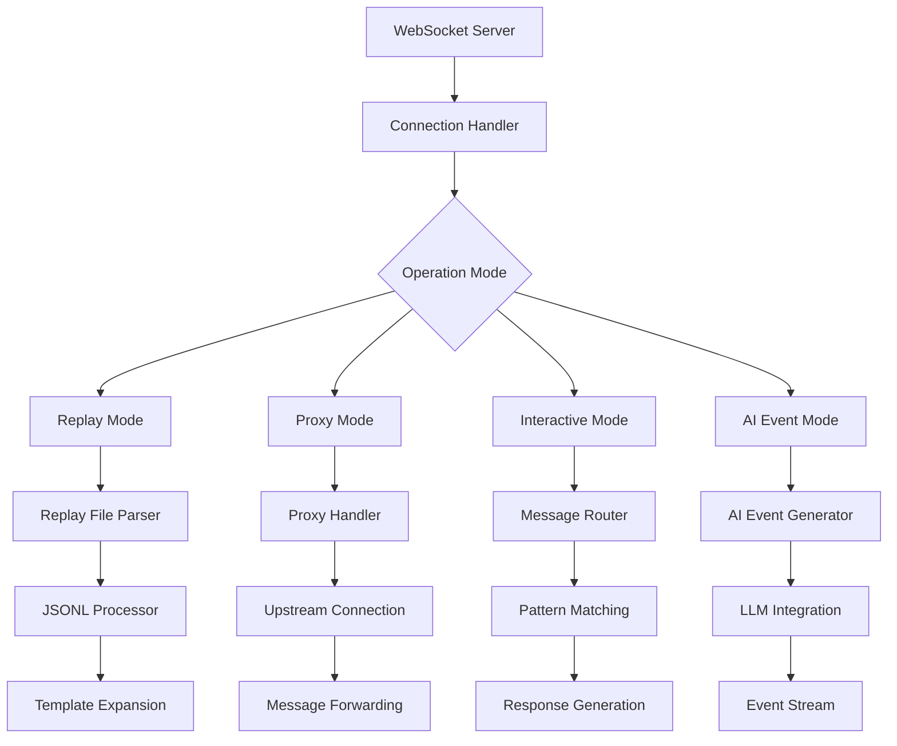

# WebSocket Crate

The `mockforge-ws` crate provides comprehensive WebSocket protocol support for MockForge, featuring replay capabilities, proxy functionality, and AI-powered event generation. It enables realistic WebSocket interaction simulation for testing and development.

## Architecture Overview



## Core Components

### Connection Management

#### WebSocket Router
The crate provides multiple router configurations for different use cases:

```rust
// Basic WebSocket router
let app = router();

// With latency simulation
let latency_injector = LatencyInjector::new(profile, Default::default());
let app = router_with_latency(latency_injector);

// With proxy support
let proxy_handler = WsProxyHandler::new(proxy_config);
let app = router_with_proxy(proxy_handler);
```

#### Connection Lifecycle
- **Establishment**: Connection tracking and metrics collection
- **Message Handling**: Bidirectional message processing
- **Error Handling**: Graceful error recovery and logging
- **Termination**: Connection cleanup and statistics recording

### Operational Modes

#### 1. Replay Mode
Scripted message playback from JSONL files:

```json
{"ts":0,"dir":"out","text":"HELLO {{uuid}}","waitFor":"^CLIENT_READY$"}
{"ts":10,"dir":"out","text":"{\"type\":\"welcome\",\"sessionId\":\"{{uuid}}\"}"}
{"ts":20,"dir":"out","text":"{\"data\":{{randInt 1 100}}}","waitFor":"^ACK$"}
```

**Features:**
- Timestamp-based message sequencing
- Template expansion (`{{uuid}}`, `{{now}}`, `{{randInt min max}}`)
- Conditional waiting with regex/JSONPath patterns
- Deterministic replay for testing

#### 2. Proxy Mode
Forward messages to upstream WebSocket servers:

```rust
let proxy_config = WsProxyConfig {
    upstream_url: "wss://api.example.com/ws".to_string(),
    should_proxy: true,
    message_transform: Some(transform_fn),
};
```

**Features:**
- Transparent message forwarding
- Optional message transformation
- Connection pooling and reuse
- Error handling and fallback

#### 3. Interactive Mode
Dynamic responses based on client messages:

```rust
// Echo mode (default)
while let Some(msg) = socket.recv().await {
    if let Ok(Message::Text(text)) = msg {
        let response = format!("echo: {}", text);
        socket.send(Message::Text(response.into())).await?;
    }
}
```

**Features:**
- Pattern-based response matching
- JSONPath query support
- State-aware conversations
- Custom response logic

#### 4. AI Event Mode
LLM-powered event stream generation:

```rust
let ai_config = WebSocketAiConfig {
    enabled: true,
    narrative: "Simulate 5 minutes of live stock market trading".to_string(),
    event_count: 20,
    replay: Some(ReplayAugmentationConfig {
        provider: "openai".to_string(),
        model: "gpt-3.5-turbo".to_string(),
        ..Default::default()
    }),
};

let generator = AiEventGenerator::new(ai_config);
generator.stream_events(socket, Some(20)).await;
```

### Message Processing

#### Template Expansion
Rich templating system for dynamic content:

```rust
// UUID generation
"session_{{uuid}}" → "session_550e8400-e29b-41d4-a716-446655440000"

// Timestamp manipulation
"{{now}}" → "2024-01-15T10:30:00Z"
"{{now+1h}}" → "2024-01-15T11:30:00Z"

// Random values
"{{randInt 1 100}}" → "42"
```

#### JSONPath Matching
Sophisticated message pattern matching:

```json
// Wait for specific message types
{"waitFor": "$.type", "text": "Type received: {{$.type}}"}

// Match nested object properties
{"waitFor": "$.user.id", "text": "User {{$.user.name}} authenticated"}

// Array element matching
{"waitFor": "$.items[0].status", "text": "First item status: {{$.items[0].status}}"}
```

### AI Integration

#### Event Generation
Narrative-driven event stream creation:

```rust
pub struct AiEventGenerator {
    engine: Arc<RwLock<ReplayAugmentationEngine>>,
}

impl AiEventGenerator {
    pub async fn stream_events(&self, socket: WebSocket, max_events: Option<usize>) {
        // Generate contextual events based on narrative
        let events = self.engine.write().await.generate_stream().await?;
        // Stream events to client with configurable rate
    }
}
```

#### Replay Augmentation
Enhance existing replay files with AI-generated content:

```rust
let augmentation_config = ReplayAugmentationConfig {
    narrative: "Add realistic user interactions to chat replay".to_string(),
    augmentation_points: vec!["user_message".to_string()],
    provider: "openai".to_string(),
    model: "gpt-4".to_string(),
};
```

### Observability

#### Metrics Collection
Comprehensive WebSocket metrics:

```rust
let registry = get_global_registry();
registry.record_ws_connection_established();
registry.record_ws_message_received();
registry.record_ws_message_sent();
registry.record_ws_connection_closed(duration, status);
```

#### Tracing Integration
Distributed tracing for WebSocket connections:

```rust
let span = create_ws_connection_span(&request);
let _guard = span.enter();
// Connection handling with tracing context
record_ws_message_success(&span, message_size);
```

#### Logging
Structured logging for connection lifecycle and message flow:

```rust
info!("WebSocket connection established from {}", peer_addr);
debug!("Received message: {} bytes", message.len());
error!("WebSocket error: {}", error);
```

### Performance Features

#### Connection Pooling
Efficient management of upstream connections in proxy mode:

```rust
// Connection reuse for proxy operations
let connection = pool.get_connection(upstream_url).await?;
connection.forward_message(message).await?;
```

#### Message Buffering
Optimized message processing with buffering:

```rust
// Stream processing for large message volumes
while let Some(batch) = message_buffer.next_batch().await {
    for message in batch {
        process_message(message).await?;
    }
}
```

#### Rate Limiting
Configurable message rate limits:

```rust
let rate_limiter = RateLimiter::new(1000, Duration::from_secs(60)); // 1000 msg/min
if rate_limiter.check_limit().await {
    process_message(message).await?;
}
```

## Configuration

### WebSocket Server Config
```rust
pub struct WsConfig {
    pub port: u16,
    pub max_connections: usize,
    pub max_message_size: usize,
    pub heartbeat_interval: Duration,
    pub replay_file: Option<PathBuf>,
    pub proxy_config: Option<WsProxyConfig>,
    pub ai_config: Option<WebSocketAiConfig>,
}
```

### Proxy Configuration
```rust
pub struct WsProxyConfig {
    pub upstream_url: String,
    pub should_proxy: bool,
    pub message_transform: Option<TransformFn>,
    pub connection_pool_size: usize,
    pub retry_attempts: u32,
}
```

### AI Configuration
```rust
pub struct WebSocketAiConfig {
    pub enabled: bool,
    pub narrative: String,
    pub event_count: usize,
    pub events_per_second: f64,
    pub replay: Option<ReplayAugmentationConfig>,
}
```

## Testing Support

### Integration Tests
End-to-end WebSocket testing:

```rust
#[tokio::test]
async fn test_websocket_replay() {
    // Start WebSocket server with replay file
    let server = TestServer::new(router()).await;

    // Connect test client
    let (ws_stream, _) = connect_async(server.url()).await?;

    // Verify replay sequence
    let msg = ws_stream.next().await.unwrap()?;
    assert_eq!(msg, Message::Text("HELLO test-session".into()));
}
```

### Replay File Validation
Automated validation of replay configurations:

```rust
#[test]
fn test_replay_file_parsing() {
    let replay_data = r#"{"ts":0,"text":"hello","waitFor":"ready"}"#;
    let entry: ReplayEntry = serde_json::from_str(replay_data)?;
    assert_eq!(entry.ts, 0);
    assert_eq!(entry.text, "hello");
}
```

## Error Handling

### Connection Errors
Graceful handling of connection failures:

```rust
match socket.recv().await {
    Ok(Some(Message::Close(frame))) => {
        info!("Client closed connection: {:?}", frame);
        break;
    }
    Err(e) => {
        error!("WebSocket error: {}", e);
        record_ws_error();
        break;
    }
    _ => continue,
}
```

### Message Processing Errors
Robust message parsing and transformation:

```rust
match serde_json::from_str::<Value>(&text) {
    Ok(json) => process_json_message(json).await,
    Err(e) => {
        warn!("Invalid JSON message: {}", e);
        send_error_response("Invalid JSON format").await?;
    }
}
```

## Usage Examples

### Basic WebSocket Server
```rust
use mockforge_ws::start_with_latency;

#[tokio::main]
async fn main() -> Result<(), Box<dyn std::error::Error>> {
    // Start with default latency profile
    start_with_latency(3001, Some(LatencyProfile::normal())).await?;
    Ok(())
}
```

### Replay Mode
```bash
# Set environment variable for replay file
export MOCKFORGE_WS_REPLAY_FILE=./replay.jsonl

# Start server
mockforge serve --ws-port 3001
```

### Proxy Mode
```rust
use mockforge_ws::router_with_proxy;
use mockforge_core::{WsProxyConfig, WsProxyHandler};

let proxy_config = WsProxyConfig {
    upstream_url: "wss://api.example.com/ws".to_string(),
    should_proxy: true,
};

let proxy = WsProxyHandler::new(proxy_config);
let app = router_with_proxy(proxy);
```

### AI Event Generation
```rust
use mockforge_ws::{AiEventGenerator, WebSocketAiConfig};

let config = WebSocketAiConfig {
    enabled: true,
    narrative: "Simulate real-time chat conversation".to_string(),
    event_count: 50,
    events_per_second: 2.0,
};

let generator = AiEventGenerator::new(config)?;
generator.stream_events_with_rate(socket, None, 2.0).await;
```

## Future Enhancements

- **Advanced Pattern Matching**: Complex event correlation and state machines
- **Load Testing**: Built-in WebSocket load testing capabilities
- **Recording Mode**: Capture live WebSocket interactions for replay
- **Clustering**: Distributed WebSocket session management
- **Protocol Extensions**: Support for custom WebSocket subprotocols