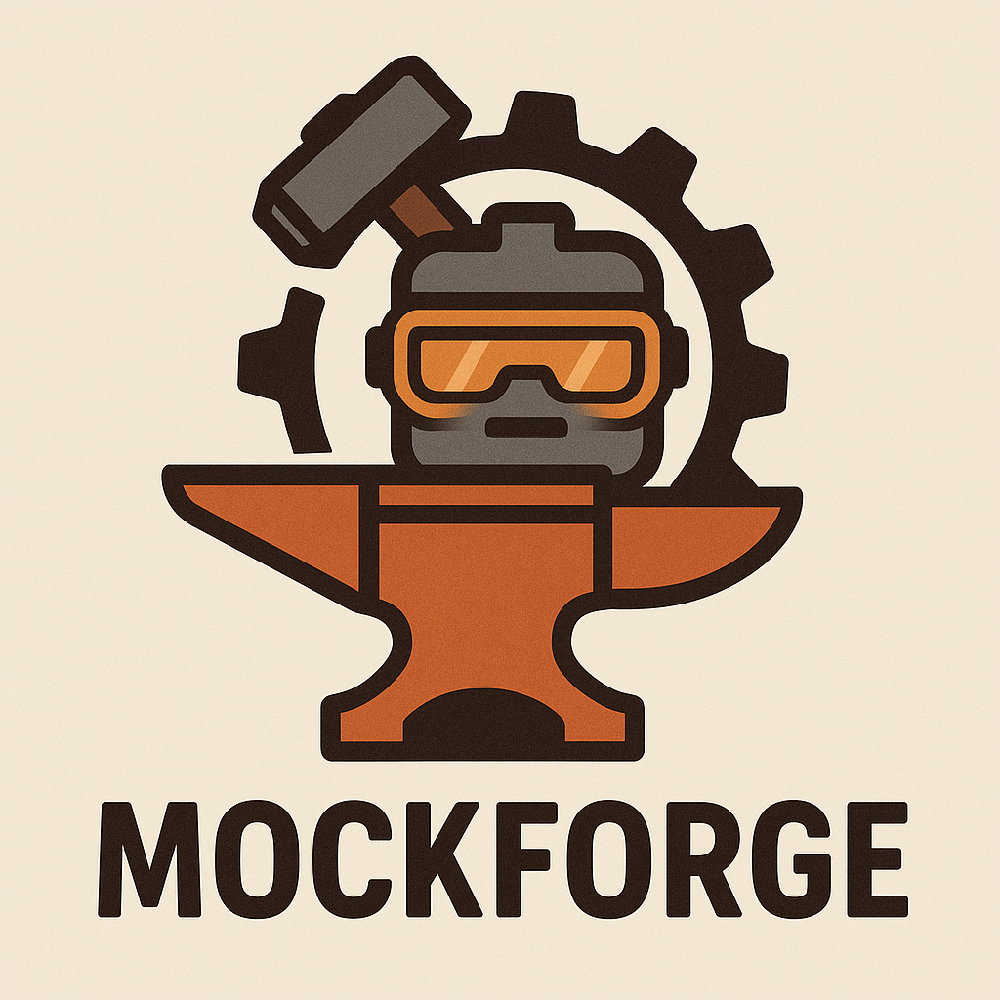

# MockForge Admin UI v2

<p align="center">
  
</p>

Modern React-based administrative interface for MockForge with comprehensive service management capabilities.

## Overview

Admin UI v2 is a complete rewrite of the MockForge admin interface using modern web technologies. It provides a rich, interactive dashboard that eliminates the need for manual file editing while offering enhanced functionality for power users.

## Features

### 🔐 **Secure Authentication**
- JWT-based authentication with role-based access control
- Admin and Viewer roles with appropriate permissions  
- Session persistence and automatic token refresh

### 🎛️ **Service Management**
- Visual toggle controls for services and individual routes
- Tag-based filtering and bulk operations
- Real-time status indicators and performance metrics

### 📁 **Advanced Fixture Management**
- Rich text editor with syntax highlighting
- Visual diff viewer for change tracking
- Drag-and-drop file organization
- Version history and rollback capabilities

### 📊 **Live Monitoring & Analytics**
- Real-time log streaming with advanced filtering
- Interactive latency histograms and performance charts
- Success/failure analysis with detailed breakdowns
- SLA monitoring with compliance indicators

### 🔍 **Powerful Search & Filtering**
- Full-text search across services, fixtures, and logs
- Multi-criteria filtering with persistent state
- Export capabilities for external analysis

## Quick Start

### Prerequisites
- Node.js 20.19+ or 22.12+
- npm or yarn package manager

### Installation
```bash
npm install
```

### Development
```bash
npm run dev
```

### Building for Production
```bash
npm run build
```

## Demo Accounts

| Role | Username | Password | Permissions |
|------|----------|----------|-------------|
| Admin | `admin` | `admin123` | Full access to all features |
| Viewer | `viewer` | `viewer123` | Read-only access to monitoring |

## Technology Stack

- **React 18** with TypeScript
- **Vite** for fast development and building
- **Shadcn UI** components built on Radix UI
- **Tailwind CSS** for styling
- **Zustand** for state management
- **Recharts** for data visualization

## License

This project is part of MockForge and follows the same dual MIT/Apache licensing.
